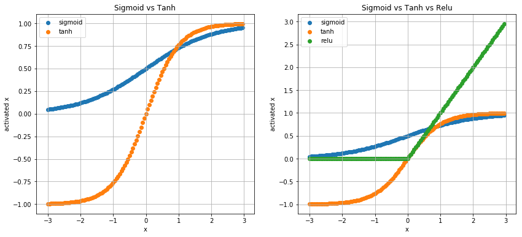
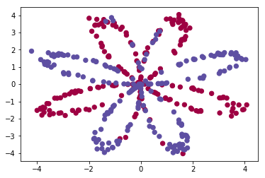
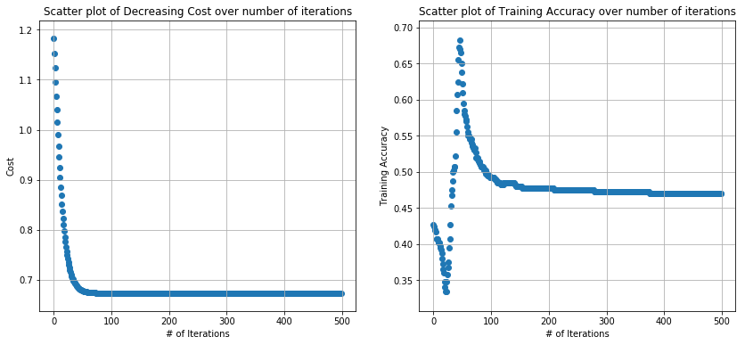

* In this following post, we will start off with building a 1-Layer Neural Net, and how it maps to Logistic Regression. We will test our functions/ model with multiple datasets. Later, we will improve on our initial model and include a hidden layer, and see how our performance increases in classification task. We will also tune/ tweak the number of hidden nodes in our hidden layer, and try to gain an intuition about how Neural Nets could be used efficiently over traditional classification models.


* Later, once we understand the basic building blocks of non-linear functions, along with forward and backward propagation steps, we will construct our very own Deep Neural Network package, with Model() and Layer() classes.


* My 2 cents: Don't worry about optimization yet; details about activation functions, mini-batch gradient descent, RMSprop, Adams Optimization and other techniques are used to fine-tune model performance, which will be covered in a different post. 

#### An intuitive understanding of a (dumb) L-layered Neural Network is the purpouse of this post.


```python
#importing necessary libraries

import numpy as np
import matplotlib.pyplot as plt
from sklearn.metrics import accuracy_score
from sklearn.model_selection import train_test_split

# source: https://github.com/rvarun7777/Deep_Learning/blob/master/Neural%20Networks%20and%20Deep%20Learning/Week%203/Planar%20data%20classification%20with%20one%20hidden%20layer/planar_utils.py
# function to load our dataset
def load_planar_dataset():
    np.random.seed(1)
    m = 400 # number of examples
    N = int(m/2) # number of points per class
    D = 2 # dimensionality
    X = np.zeros((m,D)) # data matrix where each row is a single example
    Y = np.zeros((m,1), dtype='uint8') # labels vector (0 for red, 1 for blue)
    a = 4 # maximum ray of the flower

    for j in range(2):
        ix = range(N*j,N*(j+1))
        t = np.linspace(j*3.12,(j+1)*3.12,N) + np.random.randn(N)*0.2 # theta
        r = a*np.sin(4*t) + np.random.randn(N)*0.2 # radius
        X[ix] = np.c_[r*np.sin(t), r*np.cos(t)]
        Y[ix] = j
        
    X = X.T
    Y = Y.T

    return X, Y
```

#### Activation Functions

Let's load the activation functions we will use in this exercise. We use Sigmoid function to map our input to [0,1] in the case of binary classification task. 

* The final output layer uses the Sigmoid function (remember that the activation function of Logistic regression is based on sigmoid fucntion).


* Tanh activation function is similary to Sigmoid function, but y-values go below 0. (i.e., [-1,1]), derivates are steeper when compared to Sigmoid function.


* Lets take an array from -3 to +3 with step size of 0.05. After 'activating' the input with sigmoid, tanh and relu, we see that tanh is a transformation of the sigmoid activation, whereas relu gives maximum of 0 and the value itself.


```python
# Sigmoid function -> maps input to [0,1]
def sigmoid(X):
    return (1/(1+np.exp(-X)))

# Tanh fucntions -> maps input to [-1,1]
def tanh(X):
    return np.tanh(X)

# Rectifier which maps to [0,max(x)]
def relu(X):
    return np.maximum(0,X)
```


```python
# input vector to activation functions
x = np.arange(-3,3,0.05)

# activation outputs
y_sigmoid = sigmoid(x)
y_tanh = tanh(x)
y_relu = relu(x)

# 2 plots 
plt.figure(figsize=(14,6))
plt.subplot(121), plt.scatter(x, y_sigmoid, label='sigmoid'), plt.scatter(x, y_tanh, label='tanh')
plt.grid(), plt.legend(loc='upper left'), plt.title("Sigmoid vs Tanh"), plt.xlabel('x'), plt.ylabel('activated x')

plt.subplot(122)
plt.scatter(x, y_sigmoid, label='sigmoid'), plt.scatter(x, y_tanh, label='tanh')
plt.scatter(x, y_relu, label='relu'), plt.grid()
plt.legend(loc='upper left'), plt.title("Sigmoid vs Tanh vs Relu"), plt.xlabel('x'), plt.ylabel('activated x')

plt.show()
```





* From the above graphs, we understand why Sigmoid is used for our final Layer (or Logistic Regression) in case of Binary classification; to predict either 0 or 1. Now, lets load our dataset and explore it further.


* The dataset contains 400 samples and 2 features (X1, X2).


```python
# take features into X and targets into y
X, y = load_planar_dataset()

# shapes
X.shape, y.shape
```


    ((2, 400), (1, 400))


```python
# viz input data over labels in two different colors
plt.scatter(X[0, :], X[1, :], c=y.ravel(), s=40, cmap=plt.cm.Spectral)
```


    <matplotlib.collections.PathCollection at 0x1a13e1c978>





* Now, let us consider the input feature matrix X, with shape (2, 400), represented as the zeroth layer/ input layer of our Neural Network. As we have two features (x1, x2) for our input data, we would have 2-weights (w1, w2), along with the term b, as the parameters of our model.


* We would form a linear combination of (x1, x2), along with randomly initialized weights (w1, w2, b), to form Z.


* We then activate Z, by using Sigmoid function, which returns a probability of belonging to class-1, from [0,1].


* Then, we calculate the cost/ loss with the parameters (w1, w2, b).

* The function initialize_weights return (w, b), where w is the weight vector of shape (2,1) and b is zero. It uses numpy random.rand function to generate values with seed set to 27.


* Once the output is computed, the predict function takes in the y vector which contains probabilities of belonging to class 0 or 1 and assigns class based on 0.5 threshold.


```python
def initialize_weights(X, seed=27):
    np.random.seed(seed=seed)
    w = np.random.rand(X.shape[0],1)
    b = 0
    
    return w, b

def predict(y):
    y_list = []
    y = y[0]
    for i in range(0,len(y)):
        if y[i] > 0.5:
            y_list.append(1)
        else:
            y_list.append(0)
        
    return y_list

w, b = initialize_weights(X)
w.shape, X.shape
```


    ((2, 1), (2, 400))


We can select the learning_rate and max_iteration as our hyper-parameters to train the model.


#### For each iteration:

1. compute linear combination of weights and input vector
2. activate input vector and store in vector A
3. compute cost with the current weights
4. compute derivates/ slope of cost fucntion with respect to corresponding weights
5. predict classes with updates weights


```python
# See post https://adivarma27.github.io/LogisticRegressionCost/# for detailed explanation

m = X.shape[1]
learning_rate = 0.05
max_iterations = 500
cost_list, acc_list, w1_list, w2_list, b_list = [], [], [], [], []

# iteration
for iteration in range(max_iterations):
    
    # linear-combination, activation step
    Z = np.dot(w.T, X) + b
    A = sigmoid(Z)      
    
    # compute cost 
    cost = -(1/m)*np.sum(y*np.log(A) + (1-y)*np.log(1-A))
    cost_list.append(cost)
    
    # derivative with respect to cost function
    dw = (1/m)*np.dot(X, (A-y).T)
    db = (1/m)*np.sum(A-y)
    
    # parameter update step
    w = w - learning_rate*dw
    b = b - learning_rate*db
    w1_list.append(w[0])
    w2_list.append(w[1])
    b_list.append(b)
    
    if iteration == 100:
        print(w)
        print(w.shape)
    
#     print('w, b', w, b, 'in iteration:',iteration)
    # prediction step
    y_pred = predict(A)
    acc_list.append(accuracy_score(y_pred, y.ravel()))
```

    [[ 0.03058292]
     [-0.19479807]]
    (2, 1)


```python
plt.figure(figsize=(14,6)), plt.subplot(121)
plt.scatter(np.arange(0,max_iterations), cost_list), plt.xlabel('# of Iterations'), plt.ylabel('Cost')
plt.title('Scatter plot of Decreasing Cost over number of iterations'), plt.grid()

plt.subplot(122), plt.scatter(np.arange(0,max_iterations), acc_list)
plt.xlabel('# of Iterations'), plt.ylabel('Training Accuracy')
plt.title('Scatter plot of Training Accuracy over number of iterations'), plt.grid()
plt.show()
```





#### As we see from the above graphs, as the numebr of iterations reaches 200, we observe a drop in Training accuracy, where it starts to overfit our model. In the above 1-Layer Neural Net (Logistic Regression), we try to fit our training data to our model; in our later models, we will split the data into training/ testing to predict on test data.

#### Observe that we obtain ~68 % accuracy (on 205-210 th Iteration) using Logistic Regression, where the input features are just linear combinations along with weights w1, w2, b. It does not capture complex relationships yet.


```python
plt.scatter(w1_list, cost_list, label='w1'), plt.scatter(w2_list, cost_list, label='w2'), 
plt.legend(), plt.xlabel('w1, w2 values'), plt.ylabel('Cost Function')
```


    (<matplotlib.legend.Legend at 0x1a13fd9198>,
     Text(0.5, 0, 'w1, w2 values'),
     Text(0, 0.5, 'Cost Function'))


